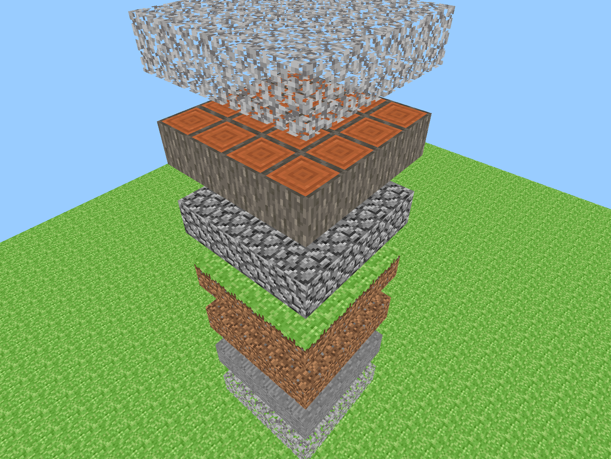

# Minecraft clone

An attempt to recreate a subset of the popular game Minecraft, learning OpenGL along the way.

## What works

* Creating and removing blocks in code
* Chunks (naive, really just 3D arrays of pointers to Blocks)
* A quad tree for storing and lazy creation of chunks
* A free-floating camera
* Multiple block types and textures
* Transparent blocks (leaves)

## Screenshots

