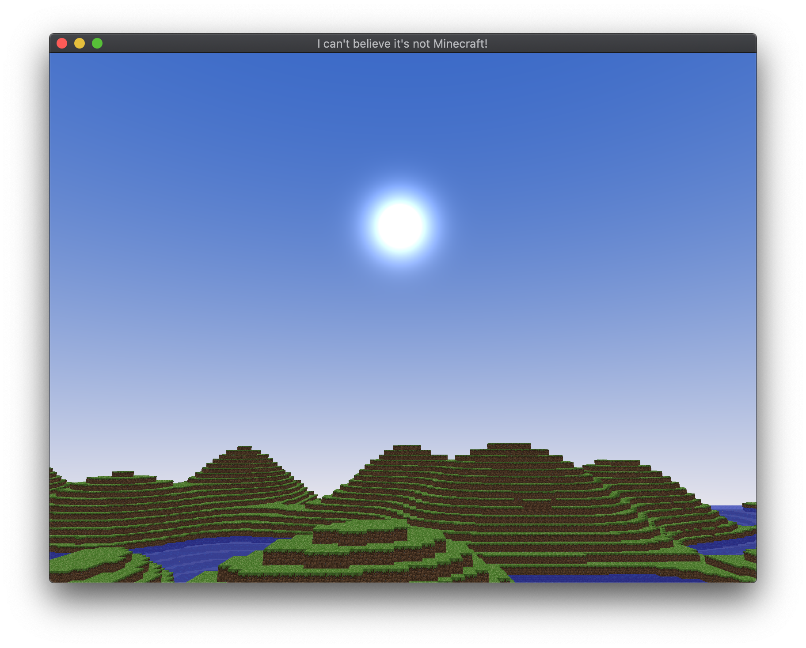

# Minecraft clone

An attempt to recreate a subset of the popular game Minecraft, learning OpenGL along the way.

## What works

* A controllable free-floating camera
* A quad tree for efficient querying of chunk info
* Chunks only generated when first seen
* Only rendering chunks in a radius around the player
* Chunk geometry loaded on a separate thread 
* Transparent and semi-transparent blocks (leaves, water)
* Seeded terrain generation based on simplex noise

## Screenshots

