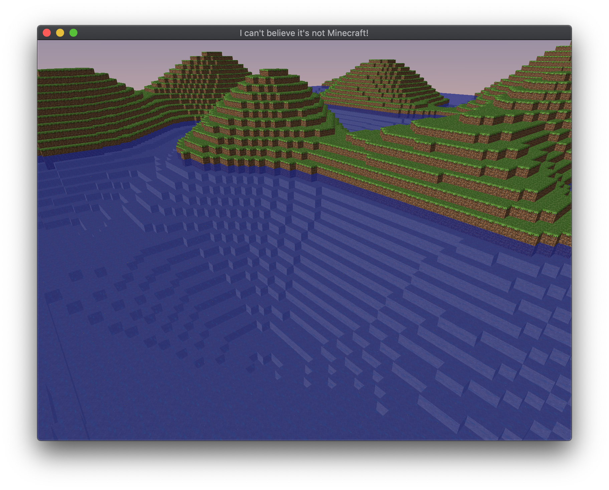

# Minecraft clone

An attempt to recreate a subset of the popular game "Minecraft", delving deeper and deeper into OpenGL and modern C++ along the way.

## What's working so far

* A controllable free-floating camera
* A quad tree for efficient querying of chunk info
* Chunks only generated when first seen
* Only rendering chunks in a radius around the player
* Chunk geometry loaded on a separate thread 
* Transparent and semi-transparent blocks (leaves, water)
* Seeded terrain generation based on simplex noise
* Two renderers - one based on glDrawElementArrays, and one based on instancing
* Simple sky block
* Day and night cycle with dynamic lighting during sunset and dusk

## Extra stuff
* GitHub Actions pipeline for releases on Linux and MacOS (Windows in the future)
* Up-to-date PlantUML class diagram in the `docs/` directory

## Screenshots

